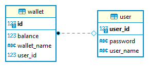

# E-Wallet

## Description

Implement e-wallet with REST API to create it, top it up, check its balance and withdraw funds using
Spring (preferably Spring Boot). Funds on any wallet should not go below zero. The project should be
built with Maven or Gradle and shipped via public VCS repository (preferably GitHub).
Please note that we expect to see two things from task. First that it works, second that you use a
professionally sound approach (e.g. best practices, principles...). Please imagine that this is a big
application and Scalability, maintainability, security, performance need to be kept in mind.
Key points:
- Implement REST API
- Implement database interaction with the domain model
- Simple React UI with the list of wallets and their balances with the option to add /
withdraw money from wallet
Bonus points for any of:
- Wallet to wallet transaction
- Running within Docker infrastructure (Dockerfile, docker-compose)
- Backend test coverage
- Basic endpoint authorization (1 account for all)
In case of any doubts, feel free to make up assumptions.

### ER Diagram:

### Tech Stack:
- Windows 11
- Java 1.8
- Maven 3.6.1
- PostgreSQL 14.5
- node v16.13.1
- npm 8.1.2
- React JS  18.2.0
- mui material 5.10.4
- Docker Desktop 4.12.0

### Starting Application:

Using Docker Desktop: run `docker compose up` in terminal/command prompt in the root of Project/repository directory.

Using Local setup:
Before starting the application, the system should have postgreSQL DB with `ewallet_db` database and credentials pastgres/root.

CMD: run `mvn clean install -DskipTests=true` and then `java -jar ./target/ewallet-0.0.1-SNAPSHOT.jar` in the root directory of the repository.

Eclipse: Import project into eclipse as existing maven project, run EwalletApplication.java as spring boot application.

### Accessing Application:
After application started use below URL to launch the app.

[http://localhost:8080/index.html](http://localhost:8080/index.html)

###Navigation:
- Use credentials user/password to login.
- Click CREATE WALLET link to create new wallet.
- After creating wallet use TOP UP/WITHDRAW buttons on wallet card to top up/withdraw amount from wallet.
- Click TRANSFER AMOUNT link to transfer amount between wallets.
- Click SWAGGER DOC link to open the swagger documentation of the API.

#### Swagger API Documentation:

[http://localhost:8080/swagger-ui](http://localhost:8080/swagger-ui)

- Click on Authentication Endpoint then click on POST api/v1/authenticate endpoint.
- Click on Try it out button and the click on Excute button. 
- As the username and password are configured as example the JWT token will be retrived from the API.
- Copy the JWT token and click on Authorize button then enter 'Bearer <JWT_TOKEN>' in the value input and click Authorize.
- Now the Wallet Endpoints can be accessed.

### Contact:
Contact me if you need any information 
LinkedIn: https://www.linkedin.com/in/lore-posam/
